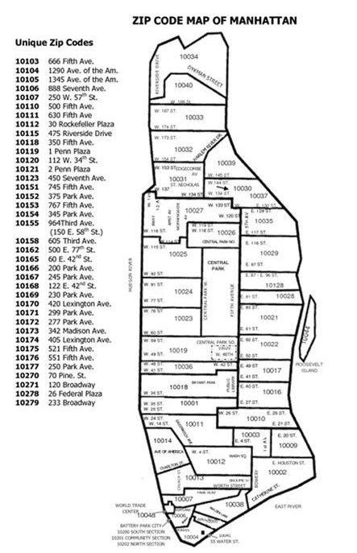
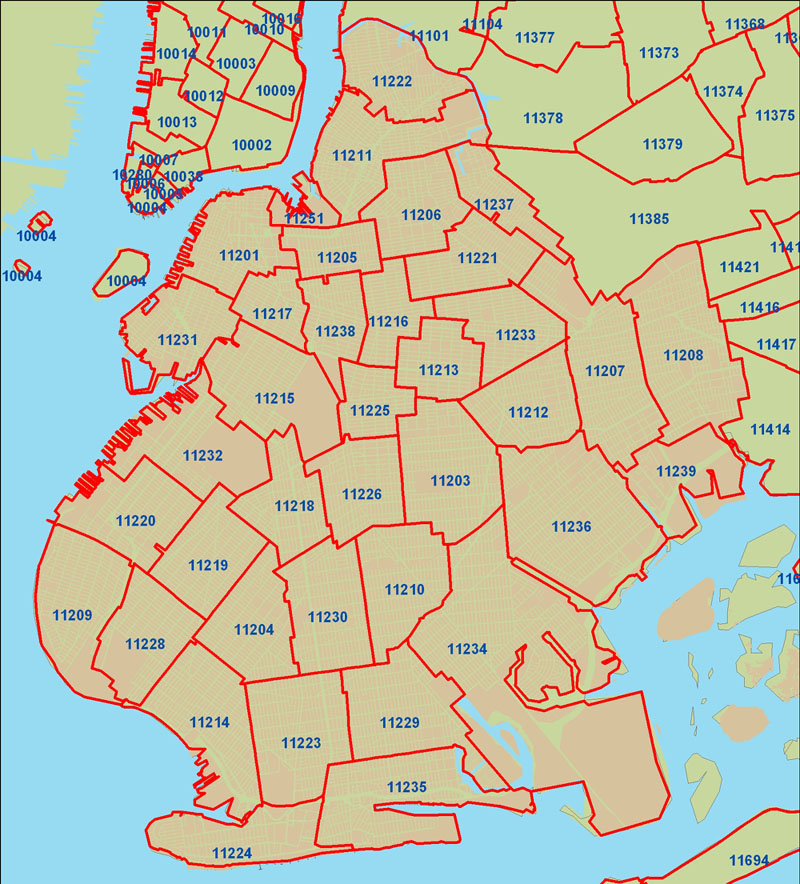
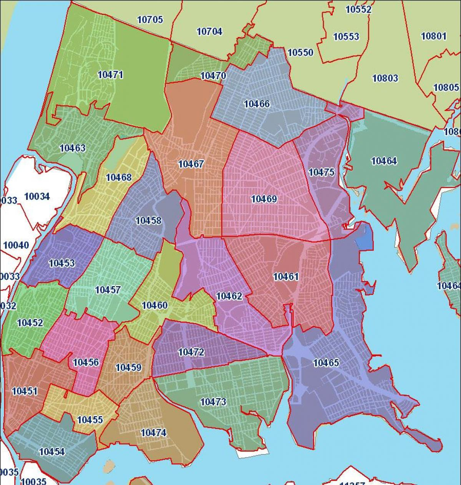

## Local NYC Jazz Event Promo Project Plan

- Author: Jeremy Donson, NYC
- Goal: How to best serve the local NYC jazz community.
- Description: This is the year that we are making moves to break new ground with a three-stage plan.  

## Table Of Contents

- [NYC Regions Of Focus](jazz-promo-nyc.md#nyc-regions-of-focus)

- [Alliance Offerings](jazz-promo-nyc.md#alliance-offerings)

- [Jazz-Centric Big-Hearted Efforts](jazz-promo-nyc.md#jazz-centric-big-hearted-efforts)

- [Local Jazz Radio Stations](jazz-promo-nyc.md#local-jazz-radio-stations)

- [Local College Jazz Music Programs](jazz-promo-nyc.md#local-college-jazz-music-programs)

- [Local Event Promo In Print](jazz-promo-nyc.md#local-event-promo-in-print)

- [Online Jazz Community Pillars](jazz-promo-nyc.md#online-jazz-community-pillars)

- [Local Jazz and Improv Music Schools](jazz-promo-nyc.md#local-jazz-and-improv-music-schools)

- [Local Bands](jazz-promo-nyc.md#local-bands)

- [Local Venues](jazz-promo-nyc.md#local-venues)

- [Sponsors Of Many Types](jazz-promo-nyc.md#sponsors-of-many-types)

- [What Is Our Commitment](jazz-promo-nyc.md#what-is-our-commitment)

- [2018 FIRST STAGE OF INITIATIVES](jazz-promo-nyc.md#2018-first-stage-of-intiatives)

- [2018 SECOND STAGE OF INITIATIVES](jazz-promo-nyc.md#2018-second-stage-of-intiatives)

- [2018 THIRD STAGE OF INITIATIVES](jazz-promo-nyc.md#2018-third-stage-of-intiatives)

- [Project Plan Enhancements](jazz-promo-nyc.md#project-plan-enhancements)

---

# NYC Regions Of Focus

- NYC ZIPS - Manhattan

---

- NYC ZIPS - Brooklyn

---

- NYC ZIPS - The Bronx

